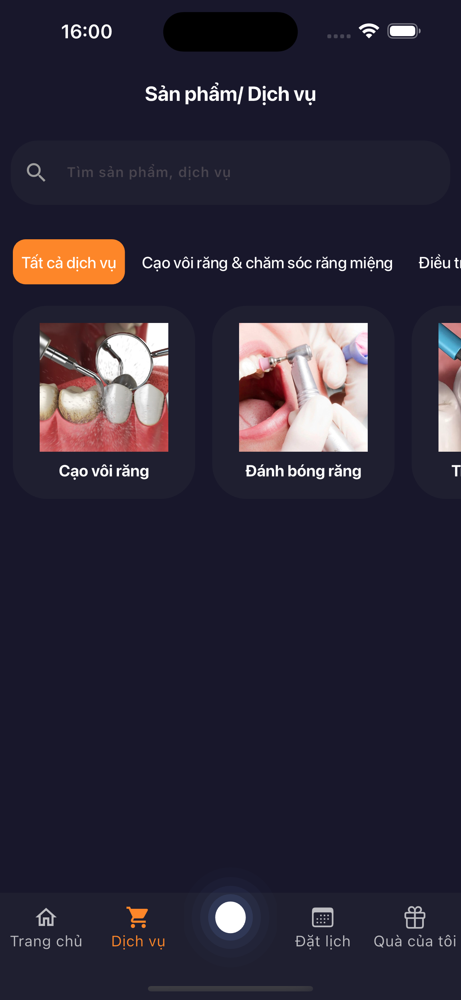
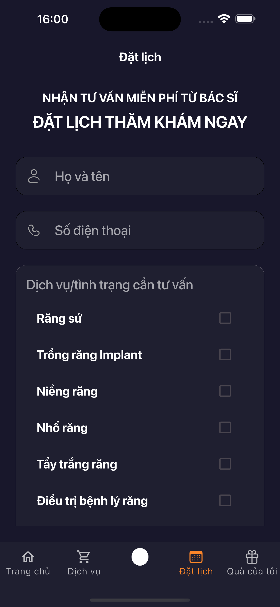
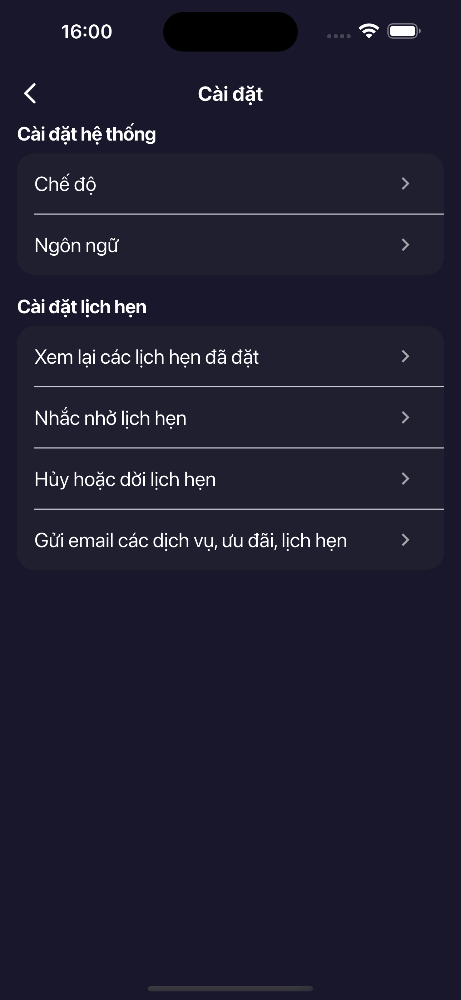
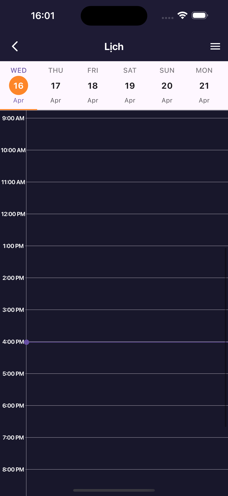
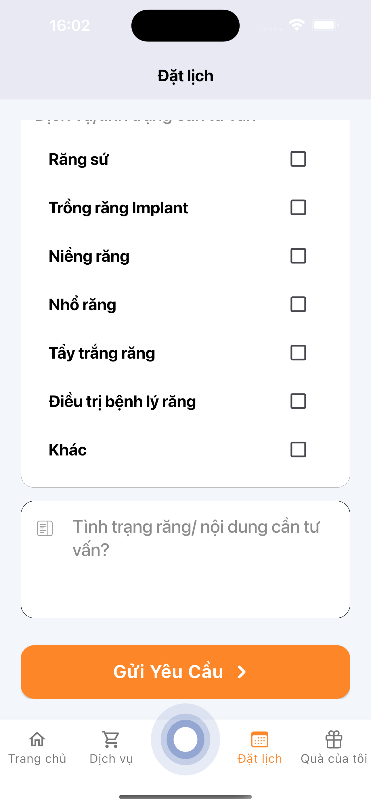

```markdown
# 🦷 Dental Care App

A modern Flutter application for managing dental care services with clean architecture, animations, and state management using Cubit.

---

## 📂 Project Structure

lib/
├── core/                     # Core modules (constants, configs, global helpers)
├── src/                      # Main application logic
│   ├── business_logic/       # Business logic layer
│   │   └── cubits/           # State management using Cubit
│   │       ├── dental_center/
│   │       ├── dental_service_type/
│   │       ├── navigation/
│   │       └── theme/
│   ├── data/                 # Data layer
│   │   ├── model/            # Data models
│   │   └── repository/       # API and data access
│   └── presentation/         # UI layer
│       ├── animation/        # Custom animations
│       ├── screen/           # Application screens
│       └── widget/           # Reusable UI components
├── utils/                    # Common utilities
└── main.dart                 # App entry point

---

## 🧩 Dependencies

This project leverages several powerful packages for building scalable and visually appealing Flutter apps:

### 📦 Core Packages
- **`flutter_bloc`**: Bloc/Cubit pattern for state management  
- **`equatable`**: Simplifies object comparison  
- **`flutter_hooks`**: Enhances code with hooks support  

### 🎨 UI & Animation
- **`animations`**: Pre-built animations  
- **`simple_animations`**: Custom animation support  
- **`lottie`**: JSON-based animations  
- **`flutter_svg`**: SVG rendering  
- **`font_awesome_flutter`**: Font Awesome icon support  
- **`badges`**: Notification badges  

### 📅 Utilities
- **`intl`**: Date/time formatting and localization  
- **`shared_preferences`**: Local data storage  
- **`url_launcher`**: Launching URLs or external apps  
- **`collection`**: Helper methods for Dart collections  

### 📆 Calendar
- **`syncfusion_flutter_calendar`**: Advanced calendar widget  

### 🧪 Dev Dependencies
- **`flutter_lints`**: Recommended linter rules  
- **`flutter_test`**: Testing tools for Flutter  

---

## 📦 Installation

### 1. Clone the repository:
```bash
git clone https://github.com//manh-nguyen-dev/dental_care.git
cd dental_care
```

### 2. Install dependencies:
```bash
fvm flutter pub get
```

### 3. Run the app:
```bash
fvm flutter run
```

---

## 📁 Assets

Make sure the following asset directories are available:

```
assets/
├── icons/
├── images/
└── lottie/
```

### Fonts used:
```yaml
fonts:
  - family: AppIcon
    fonts:
      - asset: assets/fonts/AppIcon.ttf
```

---

## 🖼️ Screenshots
Here are some screenshots of Dental Care app:

|  |  |  |  |
|---|---|---|---|
|  |  |  |  |


## 🛠 Environment

- **Flutter SDK:** ^3.7.0

---

## 📃 License & Contribution

This project is **licensed as private**.

However, contributions are welcome!  
To contribute:

1. Fork the repository
2. Create a new branch (`git checkout -b feature/YourFeature`)
3. Commit your changes
4. Push to your fork (`git push origin feature/YourFeature`)
5. Open a pull request

For major changes or feature requests, please open an issue first to discuss what you would like to change.
```